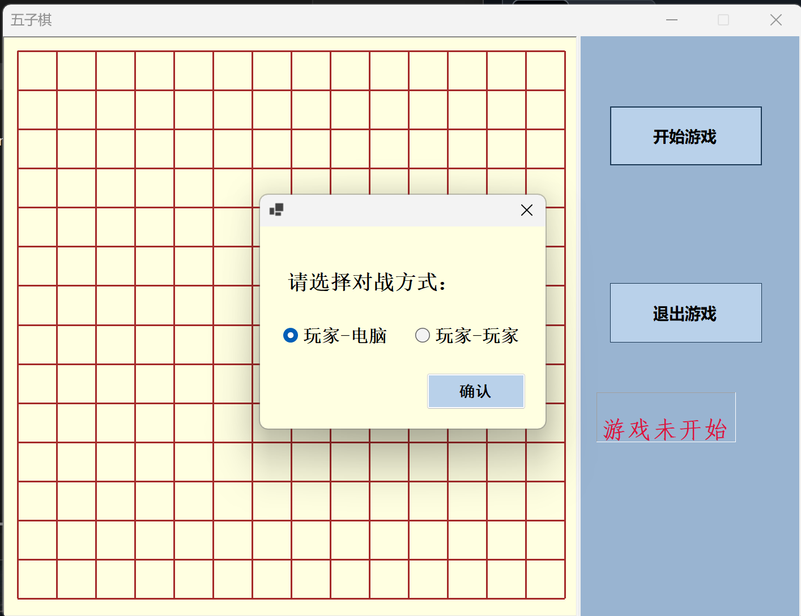
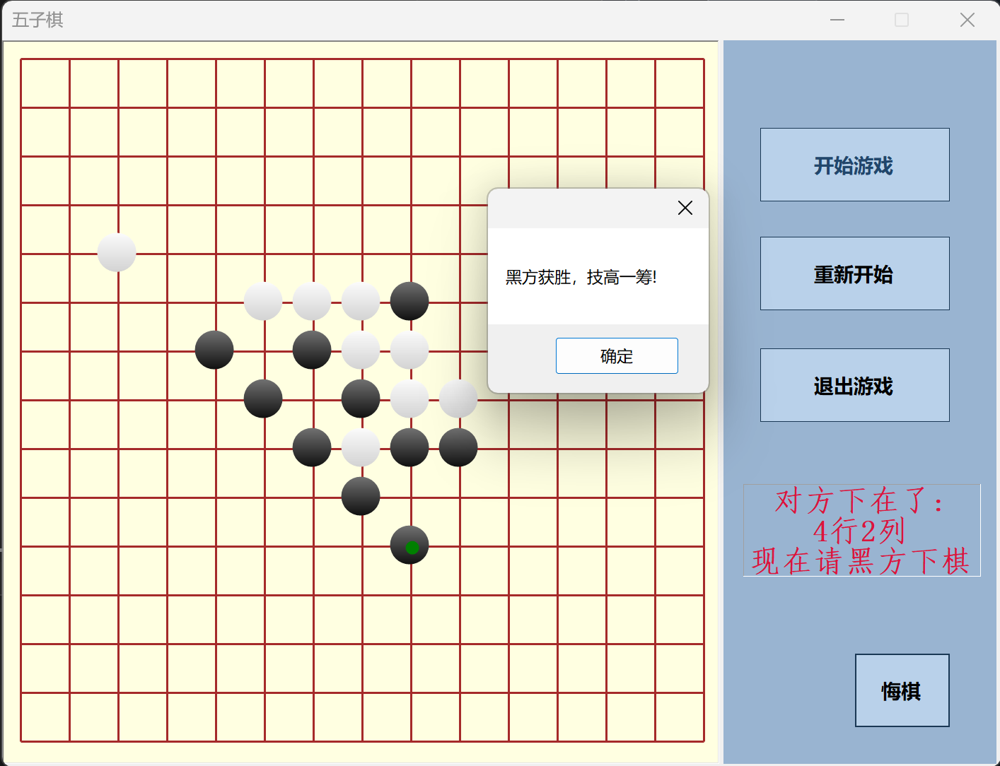

# C# 五子棋程序（人机使用Minimax算法）

## 项目简介

这是一个基于 C# 和 Windows Forms 编写的五子棋小游戏，当初是用于学习 C# 语言和熟悉 Windows 窗体编程的。  
AI 对战逻辑采用 Minimax 算法实现，代码结构简单，主要逻辑集中在一个文件内，可能适合初学者参考？

本项目解决方案内还包含一个安装包项目，基于 Visual Studio Installer，用于生成五子棋程序的安装包。

---

## 功能介绍

- 支持玩家对战 AI（AI 使用 Minimax 算法）与玩家对战玩家，但并未做联机，只能左右互搏
- 附带打包用的安装程序项目，生成 `.msi` 安装包

---

## 程序截图

游戏运行示意：

- 游戏主界面：
  

- 并不聪明的AI：
  

---

## 编译与使用方法

1. 使用 Git 克隆仓库：
   ```bash
   git clone https://github.com/ziyumieming/gobang.git

2. 使用 Visual Studio 2022 打开 .sln 解决方案文件。

3. 编译主项目，生成五子棋游戏的 .exe 可执行文件。

4. 如需生成安装包，编译解决方案中的安装项目，生成 .msi 文件。

## 注意事项
项目代码主要用于个人学习，未做架构拆分，可能阅读起来比较困难，还望谅解！

Minimax 算法实现较基础，好像是有剪枝优化的，但是搜索解空间时使用匹配编码字符串的方法，效率很低，只能搜索一个回合。

---
